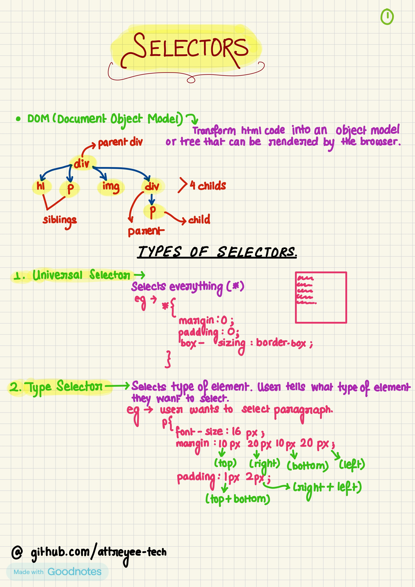
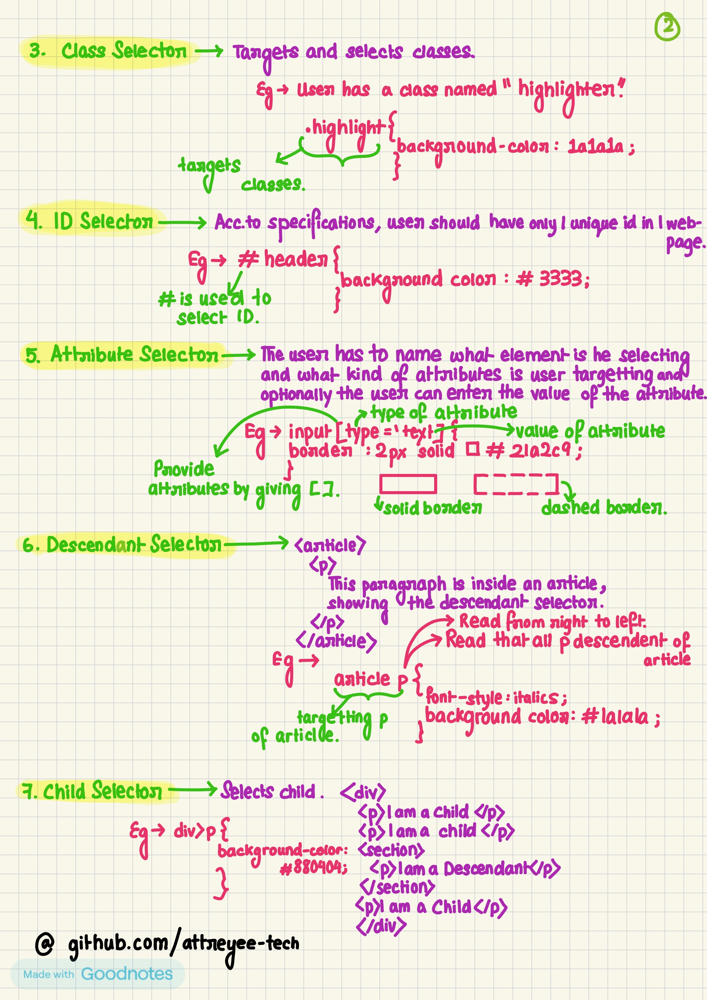
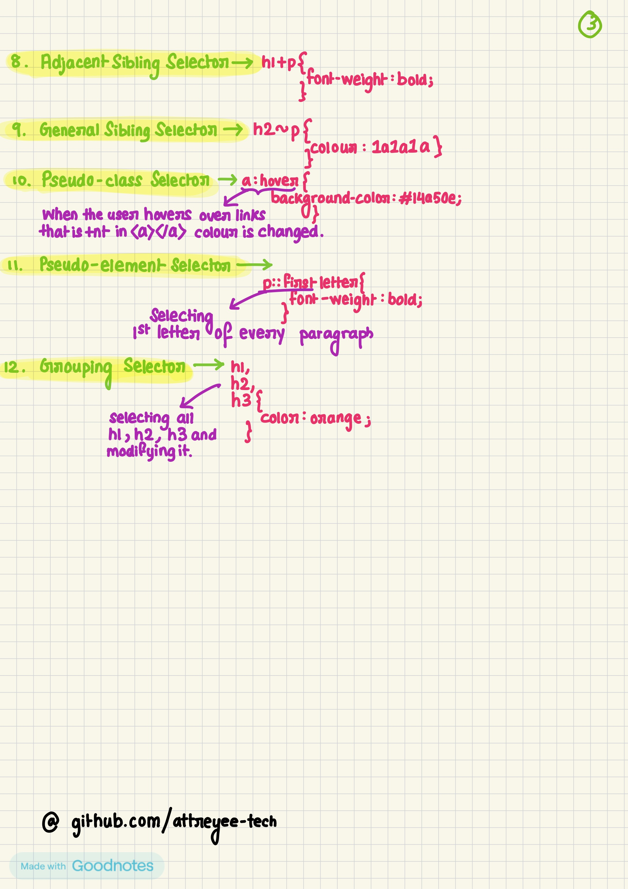
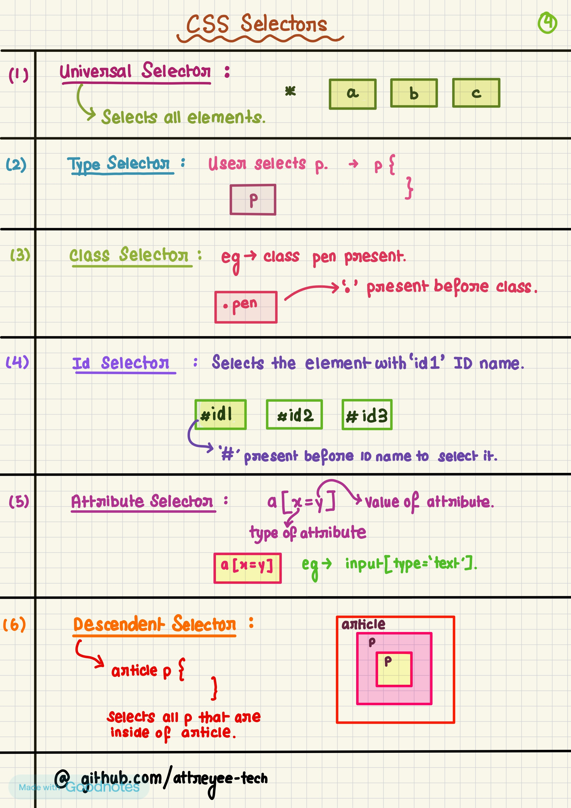
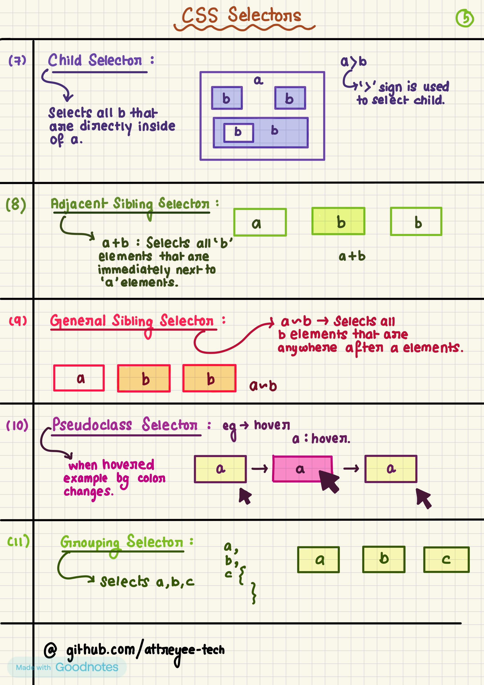

🎯 CSS Selectors Notes (Image Format)

Welcome to my CSS Selectors Notes repository! This is a visual reference guide where I document all key CSS selectors in an easy-to-digest image format.

If you're someone who learns better with visuals or just wants a quick scroll-through refresher, this repo is for you!

---

🖼️ What's Inside

This repository includes high-quality, handwritten or designed images covering:

✅ Basic Selectors.                                                   
Universal (*).                                           
Element (div, p, etc.).                                      
Class (.class-name) & ID (#id-name).     

---

🔗 Combinators
Descendant ( ), Child (>), Adjacent Sibling (+), General Sibling (~).                                    

---

🔍 Attribute Selectors.                                                            
[type], [type="text"], [type^="te"], etc.                                         
💡 Pseudo-classes.                                                                      
:hover etc.      

---

Below is the said notes:

---

🧑‍💻 About Me

Hi! I’m Attreyee, a Computer Science and Engineering student who loves front-end development and design. I’ve created these visual notes as part of my learning journey and hope they help others too!

---

🚀 Usage

Clone or download the repository
Open folders to browse images
Use them for quick revision, presentations, or as a study aid
Feel free to save and print them if needed

---

🤝 Contributions

Have a better visual explanation or want to contribute a topic? Feel free to:

Open an issue with suggestions
Submit a pull request with your own notes/images
All contributions are appreciated 💖

